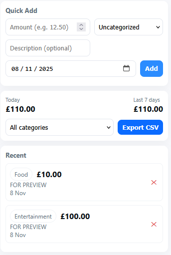

<h1 align="center">COINLOG - SAVE TIME // SAVE MONEY</h1>

CoinLog is a lightweight browser extension that helps you quickly log, view and export your daily expenses directly from your browser toolbar.

---

  

  
  
  
  
  
  
  
  

## Features

- Quick Add: Add expenses with amount, category, date, and description 

- Summaries: View today’s and last 7 days’ total spending  
- Filters: Filter expenses by category  
- Persistent Storage: Uses browser storage (no account or cloud required.)  
- Delete & Export: Remove entries or export all data to CSV  
- Cross-Browser: Works on Chrome, Edge, and Firefox (Manifest V3)

  

---

## Installation (Local Testing)

### Chrome / Edge

1. Clone or download this repository  
2. Open your browser and go to: chrome://extensions/
3. Enable **Developer mode** (top right corner)  
4. Click **Load unpacked** and select the `coinlog/` folder  
5. The CoinLog icon will appear in your toolbar

### Firefox

1. Open: about:debugging#/runtime/this-firefox
2. Click **Load Temporary Add-on**  
3. Choose the `manifest.json` file inside your `coinlog/` folder  
4. The extension will load and remain active until you restart Firefox

---

## What I used

- Manifest V3  
- Vanilla JavaScript (async/await)  
- Browser Storage API  
- HTML and CSS  

---

## Future Improvements

- Add charts for category spending breakdown  
- Editable and recurring expenses  
- Currency and local settings  
- Sync with Google Sheets or Firebase  
- Dark mode UI  

---

## Author

Author:  [@Addict-git](https://github.com/Addict-git)  
Open to contributions and feedback.

---

## License

This project is licensed under the `MIT` License. See the `LICENSE` file for details.
